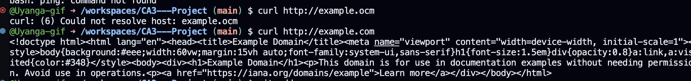
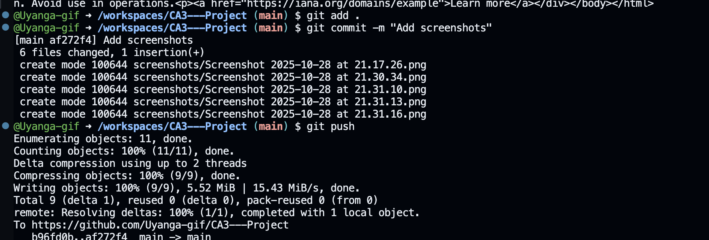

# CA3 my assignment
This is my CA3 coursework assignment.
## 1. Cloud & Virtual Machine (Github Codespaces)

## Collaboration tools

## Network 

## Github
### git status / git log

Here is my declaration:
[View Declaration PDF](./Declaration/declaration.pdf)

